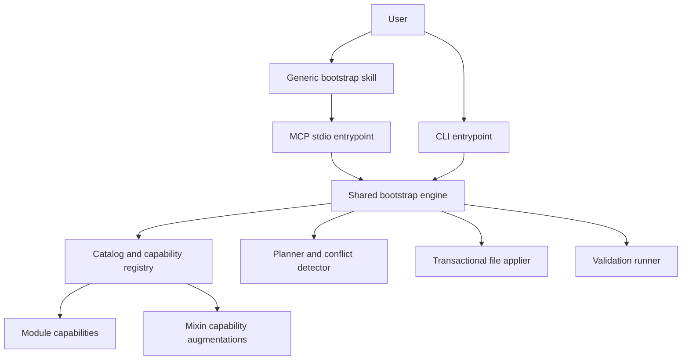

# Phase 06 - CLI and MCP Bootstrap

Date: 2026-08-08
Status: Planned

## Scope

Extend `@sabinmarcu/ai` from guidance materialization into a monorepo-aware
bootstrap system. Ship the CLI and an MCP server from the same npm package as
two entrypoints backed by one shared TypeScript engine.

This phase defines the intended architecture and delivery sequence. Its
workstreams should be implemented and validated incrementally.

## Decisions

1. Keep one npm package and produce two executable entrypoints.
2. Keep the CLI as a first-class interface for humans, CI, recovery, and
   environments without an agent host.
3. Expose typed planning and execution operations through an MCP server using
   stdio transport initially.
4. Put catalog resolution, planning, application, and validation in a shared
   engine. Neither adapter may shell out to the other.
5. Use one generic bootstrap skill as the conversational workflow layer.
6. Give each implementable module its own capability provider. Modules that
   only provide guidance do not need implementation capabilities.
7. Let mixins augment plans only when their ordinary module requirements are
   active in the relevant scope.
8. Plan before applying. Plans are immutable, reviewable, target-bound, and
   rejected when stale.
9. Treat repository inspection and desired-state applicability as separate
   concepts. An empty target must be eligible for bootstrap even when normal
   module applicability expects files that do not exist yet.
10. Support monorepos in the state model before adding monorepo bootstrap
    behavior.
11. Make `ai init` the convergent full bootstrap and expose `repo`, `tool`,
  and `mcp` init modes for partial setup.
12. Treat Git as universal repository foundation, while creating a Yarn/Node
  project only for explicitly selected Node repositories.
13. Use a project-local `@sabinmarcu/ai` development dependency and
  `yarn exec ai-mcp` in Node repositories.
14. Keep Unix repositories free of an artificial `package.json`; configure
  their MCP server through an exact-version Yarn `dlx` invocation.
15. Use `dlx` as the initial installer bridge, not as the default persistent
  runtime when a local Node project dependency is appropriate.
16. Build on the catalog detection model from Phase 02 and scoped inspection
  and cache lifecycle from Phase 03 rather than redefining them here.

## Goals

- Bootstrap a repository or monorepo from selected architecture modules.
- Initialize empty Node and Unix repositories with an appropriate tool and MCP
  installation model.
- Add projects to a monorepo with an explicitly selected architecture.
- Configure tooling such as ESLint at repository or project scope.
- Compose module dependencies and mixins deterministically.
- Preview all owned file changes, package mutations, commands, and validations.
- Apply the same operation through the CLI or MCP with equivalent results.
- Make repeated application of the same desired state converge to no changes.
- Materialize relevant AI instructions and skills alongside implemented code.
- Preserve isolated consumer repositories with no runtime dependency on this
  source repository.

## Non-Goals

- Using an LLM to generate arbitrary files without a typed plan.
- Exposing an unrestricted shell tool through MCP.
- Replacing the CLI with MCP.
- Making every guidance module executable.
- Supporting third-party executable catalog plugins in the first version.
- Implementing remote MCP transport in the first version.
- Persisting mixins as user-selected stack entries.

## Target Architecture



Suggested source boundaries:

```text
src/
  cli.ts
  mcp.ts
  engine/
    inspect.ts
    desired-state.ts
    resolve.ts
    plan.ts
    apply.ts
    validate.ts
    fingerprint.ts
  capabilities/
    registry.ts
    arch-monorepo/
    arch-node-package/
    arch-web-react/
    tooling-eslint/
    mixins/
  adapters/
    cli/
    mcp/
```

The final layout should follow the repository's local conventions as they
evolve. The important boundary is that adapters depend on the engine and the
engine does not depend on either adapter.

Catalog modules carry their executable definition alongside their assets:

```text
catalog/modules/<module>/
  module.json
  detect.mjs
  files/
```

Modules without a reliable automatic signal may omit `detect.mjs` and remain
explicitly selectable.

Repository inspection, module-owned detection, scoped dependency resolution,
mixin activation, and repository utility cache lifecycle are prerequisites
defined by Phase 02 and Phase 03. This plan consumes their resulting scoped
stack model for bootstrap planning and does not own those implementations.

## Package Entrypoints

Change the package from a single `bin` string to an explicit binary map with
`ai` as the CLI and `ai-mcp` as the MCP server:

```json
{
  "bin": {
    "ai": "./dist/cli.js",
    "ai-mcp": "./dist/mcp.js"
  }
}
```

Both entrypoints are compiled by the existing TypeScript build. The MCP server
uses stdio and must not write protocol logs to stdout. Diagnostics go to stderr.

Add the official MCP TypeScript SDK as a runtime dependency. Keep Zod schemas
at the engine boundary so CLI inputs, MCP inputs, catalog metadata, plans, and
state share validation rules.

The unambiguous one-shot bootstrap command is:

```sh
yarn dlx @sabinmarcu/ai init --type node
```

The `ai` binary matches the unscoped portion of `@sabinmarcu/ai`, so npm and
Yarn package runners can select it as the default executable. The secondary
`ai-mcp` binary does not match the package name and must use explicit
package-to-binary mapping when it is launched through `dlx`.

## Core Domain Model

### Desired State

Desired state describes what the user wants, not how to edit files:

```yaml
target: .
scopes:
  - path: .
    kind: repository
    modules:
      - global/core
      - arch/monorepo
      - arch/node-package
      - tooling/eslint
  - path: apps/web
    kind: project
    modules:
      - arch/web-application
      - arch/web-react
  - path: packages/shared
    kind: project
    modules:
      - arch/node-library
      - lang/typescript
options:
  packageManager: yarn
  reactBuilder: vite
```

Desired state may be supplied all at once or assembled incrementally by CLI
flags or an agent conversation.

### Scoped Stack State

The current stack model is repository-wide. Introduce a versioned scoped model
before implementing monorepo operations:

```yaml
version: 2
createdAt: 2026-08-08T00:00:00.000Z
scopes:
  - path: .
    kind: repository
    presets: []
    modules:
      - global/core
      - arch/monorepo
      - tooling/eslint
  - path: apps/web
    kind: project
    presets: []
    modules:
      - arch/web-application
      - arch/web-react
```

Rules:

- Normalize and validate all scope paths relative to the repository root.
- Reject overlapping project roots unless a supported nesting rule exists.
- Keep mixins out of selected state.
- Preserve explicit module selection separately from effective resolution.
- Define which repository-scoped modules govern descendants. Do not infer
  inheritance from category names alone.
- Resolve mixins against the effective modules governing each scope.
- Record enough resolution information in status or lock data to explain why a
  module or mixin is active.
- Provide an explicit version 1 to version 2 migration path.

### Module Scope and Coverage

Monorepo composition needs an explicit coverage rule. For example, a root
`tooling/eslint` selection may govern all projects, while a project-local
selection governs only one project.

Add a small, explicit scope model rather than hidden inheritance:

```ts
type CapabilityCoverage = 'scope' | 'descendants';
```

The selected module instance or its capability input determines coverage. The
module manifest defines valid/default coverage. Effective project resolution
contains:

- modules selected directly at the project scope
- dependencies of those modules
- ancestor module instances whose coverage includes descendants

This allows `mixin/react-eslint` to activate for a React project governed by a
root ESLint configuration without pretending that every root module is a local
project selection.

### Capability Metadata

Extend ordinary module and mixin manifests with optional capability metadata.
A first version can use a compiled registry rather than dynamic code loading:

```json
{
  "capabilities": {
    "bootstrap": {
      "provider": "arch-monorepo/bootstrap",
      "defaultCoverage": "scope"
    },
    "add-project": {
      "provider": "arch-monorepo/add-project",
      "defaultCoverage": "scope"
    }
  }
}
```

The catalog loader validates that every referenced provider exists in the
compiled registry. Templates and reference assets remain module-owned catalog
assets. Executable TypeScript remains compiled with the package in the first
version.

Do not add a general catalog plugin loader until there is a concrete need to
ship third-party executable capabilities independently.

### Capability Contract

```ts
interface ModuleCapability<TInput> {
  inspect(context: InspectionContext): Promise<ModuleFacts>;
  inputs(context: InputContext): Promise<InputDefinition[]>;
  plan(context: PlanningContext, input: TInput): Promise<ChangeSet>;
  validate(context: ValidationContext): Promise<ValidationResult[]>;
}
```

Capabilities produce structured changes. They do not write directly to the
target and do not independently install dependencies.

## Structured Change Model

Use a deliberately small set of operations:

- create a directory
- create a file from owned content or an owned template
- update a JSON document structurally
- update a YAML document structurally
- update package dependencies and scripts
- remove a previously managed path
- run an approved executable with structured arguments
- run a validation command

Each operation includes:

- stable operation ID
- owning module or mixin
- target scope and path
- preconditions
- before and after summaries
- sensitivity or risk classification
- dependencies on earlier operations
- rollback information where practical

Avoid an unrestricted command string in plans. Command operations should use an
executable plus an argument array and must come from trusted compiled
capabilities.

Structured parsers must be used for package manifests and configuration files.
Text replacement is reserved for formats without a suitable structured model
and requires strong preconditions.

## Planning Model

### Plan Contents

An immutable plan contains:

```ts
interface BootstrapPlan {
  version: 1;
  id: string;
  target: string;
  targetFingerprint: string;
  request: DesiredState;
  resolvedScopes: ResolvedScope[];
  operations: PlannedOperation[];
  validations: PlannedValidation[];
  warnings: PlanWarning[];
  createdAt: string;
}
```

The ID is derived from a canonical representation of the plan. Absolute local
paths and timestamps must not affect the semantic plan digest.

The target fingerprint covers only files and facts used to produce the plan.
Before application, recalculate it and reject stale plans with an actionable
message.

### Planning Pipeline

1. Inspect repository and project facts.
2. Validate desired scope paths and requested capabilities.
3. Resolve ordinary module dependencies for each scope.
4. Apply explicit ancestor coverage.
5. Activate matching mixins from effective ordinary module sets.
6. Ask capability providers to produce changes.
7. Merge compatible structured mutations.
8. reject conflicting ownership or incompatible mutations.
9. Topologically order operations.
10. Attach narrow and repository-wide validations.
11. Calculate the target fingerprint and plan ID.
12. Return a reviewable plan without changing the target.

The merge layer must detect when two providers attempt to own the same path or
set incompatible values in the same structured document. Silent last-writer
wins behavior is forbidden.

### Plan Persistence

Start with server-session plan storage for MCP and in-memory planning followed
by immediate application for the CLI. Add persisted plan files only if users
need review across processes or sessions. Do not place planning sidecars inside
generated project output directories.

If cross-process application is required early, encode the complete canonical
plan in a temporary file under the repository's existing AI state boundary or
require replanning before apply. The security model must not trust a plan ID
without access to the corresponding canonical plan.

## Application Model

Application proceeds in explicit stages:

1. Load the immutable plan.
2. Reinspect preconditions and verify the target fingerprint.
3. Acquire a repository-local operation lock.
4. Stage file mutations and preserve original content needed for rollback.
5. Commit deterministic file mutations.
6. Run approved dependency or generator commands.
7. Run focused validations.
8. Materialize selected instructions, skills, and managed metadata.
9. Write scoped stack state only after required operations succeed.
10. Report applied, skipped, failed, and rolled-back operations.

File changes should be atomic where the filesystem permits it. External package
manager and generator commands cannot be assumed fully reversible. Plans must
label that risk before approval and application must preserve a recovery
report.

Idempotency requirements:

- Existing desired content is a no-op.
- Existing compatible package fields are preserved.
- Existing incompatible unmanaged content causes a conflict, not replacement.
- Rerunning the same desired state after success returns an empty plan.
- Failed validation does not falsely record the desired state as complete.

## MCP Surface

Keep the initial tool surface small and intent-oriented:

### `bootstrap_inspect`

Inspect a target and return repository facts, scopes, package manager evidence,
current stack state, and available capabilities.

### `bootstrap_inputs`

Return unresolved typed inputs for a proposed desired state. The agent asks the
user; the MCP server does not conduct an interactive terminal dialogue.

### `bootstrap_plan`

Accept desired state and resolved inputs, then return an immutable plan summary
and plan ID. It performs no target mutations.

### `bootstrap_apply`

Apply a previously produced plan after explicit user approval. Require the plan
ID and its expected digest. Reject unknown, changed, expired, or stale plans.

### `bootstrap_validate`

Run or report the validations associated with an applied plan or current stack.

### `bootstrap_status`

Explain selected modules, effective modules, active mixins, managed drift, and
incomplete or failed operations by scope.

Do not expose a generic `run_command` tool. Tool schemas should use
discriminated unions and return structured errors suitable for agent recovery.

Use MCP tool annotations and descriptions to distinguish read-only planning
from mutating application. The generic skill must always present a plan before
calling the mutating tool.

## CLI Surface

The CLI should expose the same engine operations in human-oriented form. An
illustrative command surface is:

```text
ai init --type node
ai init --type unix
ai init repo --type node
ai init tool
ai init mcp
ai inspect
ai bootstrap arch/monorepo --plan
ai project add apps/web --arch arch/web-application --module arch/web-react --plan
ai configure tooling/eslint --scope . --coverage descendants --plan
ai apply <plan>
ai status
ai verify
ai mcp
```

Whether `ai-mcp` starts a dedicated binary or delegates to `ai mcp` is an
adapter detail. Both must start the same MCP server implementation if both are
supported.

Preserve non-interactive flags and structured output for CI. Interactive CLI
prompts may be added later but must not be required by the engine.

## Initialization and MCP Runtime

### Command Contracts

`ai init` is the idempotent full bootstrap. It composes these narrower
operations in dependency order:

```text
ai init repo    # repository foundation
ai init tool    # package runtime and AI workflow assets
ai init mcp     # MCP server configuration
```

Rules:

- `ai init --type node` runs repository, tool, and MCP initialization for a
  Node repository.
- `ai init --type unix` runs repository, tool, and MCP initialization without
  creating a Node project.
- An empty directory requires `--type node|unix` in non-interactive use. An
  interactive adapter may ask rather than guess.
- `init repo` runs `git init` when needed. For `--type node`, it also creates a
  Yarn Modern project and pins the selected Yarn and Node toolchain according
  to active policy. For `--type unix`, it does not create `package.json`.
- `init tool` ensures the Phase 03 baseline AI entrypoint and reconciliation
  skill are present, then adds the generic bootstrap skill. In a Node repository
  it also adds the exact running version of `@sabinmarcu/ai` to
  `devDependencies` and updates the lockfile.
- `init mcp` structurally merges the `ai` server into the supported MCP
  configuration without replacing unrelated servers.
- Partial commands validate their prerequisites and provide the exact prior
  command needed when a prerequisite is absent.
- Every mode preserves compatible existing state, reports incompatible
  unmanaged state, and converges to no changes when repeated.

Initialization is necessarily a direct bootstrap mutation rather than an MCP
plan because the MCP server and workflow assets may not exist yet. It should
still use the shared inspection, structured mutation, ownership, and validation
primitives wherever possible.

### Node Repository Runtime

For a Node repository, the one-shot `dlx` process installs its exact running
package version into project `devDependencies`. The persistent MCP command then
uses the lockfile-managed project binary:

```json
{
  "mcpServers": {
    "ai": {
      "type": "stdio",
      "command": "yarn",
      "args": ["exec", "ai-mcp"]
    }
  }
}
```

This keeps instructions, the CLI, and the MCP implementation on one
repository-pinned version and avoids network resolution during normal MCP
startup.

### Unix Repository Runtime

For a Unix or other non-Node repository, do not create `package.json` solely to
host the AI tooling. Configure MCP to launch an exact package version through
Yarn:

```json
{
  "mcpServers": {
    "ai": {
      "type": "stdio",
      "command": "yarn",
      "args": [
        "dlx",
        "--package",
        "@sabinmarcu/ai@<exact-version>",
        "ai-mcp"
      ]
    }
  }
}
```

The exact version is written by the running initializer, not represented by a
floating tag. This mode may need network access when the package is not already
cached. Status and upgrade workflows must report and update the configured
version explicitly.

Allow `ai init mcp --runtime local|dlx` as an advanced override, but default
from repository type: `local` for Node and `dlx` for Unix. Reject `local` when
the project dependency is unavailable rather than generating a broken command.

## Generic Bootstrap Skill

The generic skill is a workflow client, not an implementation engine. It
should:

1. Detect whether the MCP tools are available.
2. Translate user intent into desired scopes and module selections.
3. Call inspection and input-discovery tools.
4. Ask only unresolved questions.
5. Request a plan.
6. Summarize ownership, important changes, commands, risks, and validations.
7. Obtain explicit approval.
8. Apply the exact reviewed plan.
9. Report validation and recovery information.

The skill must not reimplement dependency resolution or emit configuration from
memory. It should prefer MCP and fall back to equivalent CLI commands only when
the MCP server is unavailable.

Build this broader bootstrap workflow on the baseline AI entrypoint and stack
reconciliation skill delivered in Phase 03. Phase 06 may extend that workflow
with desired-state planning, project creation, and MCP transport, but must not
introduce a second installed-AI index or a separate reconciliation algorithm.

The documented first-bootstrap path is `yarn dlx @sabinmarcu/ai init --type
<node|unix>`. Once initialization completes, the generic skill uses
the configured MCP server. The package may expose an MCP prompt as a
convenience, but that prompt must not become the only workflow definition.

## Initial Module Ownership

### `arch/monorepo`

Owns:

- repository workspace topology
- canonical project discovery
- root workspace metadata
- adding and registering project boundaries
- repository-level validation of discovery consistency

It must not choose a package manager or task runner without explicit user input
or a selected tooling module.

### `arch/node-package`

Owns the baseline Node project/package shape shared by packages, tools, apps,
and web apps where applicable. Audit whether architecture modules that always
produce a Node project should depend on this module rather than duplicating its
bootstrap capability.

### `arch/node-root-package`

Owns repository-root Node package policy for monorepos and standalone packages.
Its bootstrap capability composes ESLint, lint-staged, Husky, and commitlint at
the root while leaving workspace-local packages on the generic Node package
baseline.

### `arch/node-application`

Owns deployable Node server and service behavior beyond the common Node project shape.

### `arch/web-react`

Owns React component and state architecture for both applications and libraries.
Concrete web application or library classification is selected independently.

### `lang/typescript`

Owns TypeScript compiler setup and source conventions, not generic package
creation.

### `tooling/eslint`

Owns concrete ESLint installation, configuration, scripts, editor integration,
and validation. It consumes project facts but does not own architecture.

### `tooling/yarn`

Owns Yarn Modern installation and configuration, linker selection, SDKs, and
generated-file policy. Monorepo hook checks remain mixin-owned.

### `tooling/husky`

Owns Husky installation, lifecycle setup, and hook structure. Commands supplied
by other tools remain mixin-owned.

### `tooling/commitlint`

Owns commitlint installation, configuration infrastructure, and package
scripts, not commit format, scope policy, or Git hook integration.

### `tooling/lint-staged`

Owns lint-staged installation and its package script. Tool-specific staged-file
mappings remain mixin-owned.

### Mixins

- `mixin/typescript-eslint` augments ESLint plans when TypeScript is effective.
- `mixin/react-eslint` augments ESLint plans when React is effective.
- `mixin/eslint-lint-staged` maps staged source files to fixing ESLint.
- `mixin/husky-lint-staged` composes lint-staged into pre-commit.
- `mixin/husky-typescript` composes type checking into pre-commit.
- `mixin/husky-commitlint` composes commitlint into the commit-msg hook.
- `mixin/commitlint-conventional-commits` maps universal Conventional Commits
  guidance to commitlint configuration.
- `mixin/conventional-commits-monorepo` specializes authoring guidance with
  required workspace and repository scopes.
- `mixin/commitlint-monorepo-scopes` enforces those scopes through the workspace
  shareable config in Node monorepos.
- `mixin/husky-yarn-monorepo` composes Yarn constraints and version checks at
  monorepo scope.
- Do not add `mixin/monorepo-eslint` merely because both modules are selected.
- Reconsider `mixin/monorepo-eslint` only if root-versus-project ownership,
  task-graph integration, or affected lint configuration creates concrete
  implementation that neither ordinary module owns alone.

### Mixin Decision Rules

- Add a mixin only when concrete configuration or guardrails are valid only at
  the intersection of all required ordinary modules.
- Recommendations, prohibitions, common preset membership, ordinary
  parent-child dependencies, and implementation fully owned by one tooling
  module do not justify a mixin.
- For each candidate, record its required modules, intersection-specific
  behavior, why no ordinary module owns it, and any blocker in this phase.
- Keep mixins out of presets and selected stack state.

### Deferred and Rejected Mixin Decisions

- Defer `mixin/monorepo-typescript-eslint` until type-aware linting across
  project references requires behavior not owned by existing two-way mixins.
- Defer `mixin/typescript-web-library` until browser compiler configuration or
  accidental Node typing leakage requires intersection-specific validation.
- Defer `mixin/library-eslint` until effective-config validation proves the
  shared ESLint baseline does not already exclude `/dist` while covering
  `/src`.
- Add Storybook or type-testing ESLint mixins only after corresponding ordinary
  modules exist. The shared config conditionally supports
  `eslint-plugin-storybook` and `eslint-plugin-expect-type`.
- Reject `mixin/node-package-eslint`: Node package architecture may recommend
  ESLint and prohibit Prettier, but concrete setup belongs to `tooling/eslint`.
- Do not add web-platform or web-style ESLint mixins while the shared config
  already owns browser/Node globals and logical-property linting.
- Do not add a two-way `mixin/husky-yarn` while constraints and version checks
  are monorepo-specific; keep that behavior in the three-way mixin.

### Upstream and Upgrade Risks

- `@sabinmarcu/eslint-config` documentation still describes older split
  TypeScript parser/plugin packages, while current source imports the
  `typescript-eslint` package. Do not copy the stale dependency model.
- React ESLint completion guidance remains temporary while shared React rules
  target `*.jsx` but not `*.tsx`, and the Hooks config registers its plugin
  without enabling recommended rules. Remove the temporary guidance only after
  equivalent JSX and TSX behavior is verified upstream.
- `@sabinmarcu/commitlint-config-workspaces` currently has skipped source tests
  and opinionated repository scopes. Validate scope discovery when upgrading it
  or `@sabinmarcu/utils-repo`.
- Recheck commit-message argument forwarding and package-script conventions
  when commitlint or Husky changes its recommended setup.
- Keep `tooling/lint-staged` task-agnostic. Add mappings only in integrations
  with tools that perform the staged-file work.
- Revalidate Yarn constraints and `yarn version check` behavior on Yarn
  upgrades. Split general Husky-Yarn behavior from monorepo behavior only when a
  concrete single-project check appears.

## Delivery Workstreams

### Workstream A - Contracts and Shared Engine Boundary

Deliverables:

- Extract catalog and stack use cases behind adapter-neutral services.
- Define desired state, scoped resolution, plan, operation, and validation
  schemas.
- Define typed errors shared by CLI and MCP.
- Add architecture tests proving adapters do not contain domain behavior.

Exit criteria:

- Existing CLI behavior remains unchanged.
- Engine services can be invoked without constructing Clipanion commands.
- Canonical serialization is deterministic.

### Workstream B - Scoped Monorepo State

Deliverables:

- Stack schema version 2 with repository and project scopes.
- Version 1 migration.
- Explicit module coverage and effective-scope resolution.
- Scope-aware mixin activation and diagnostics.
- Detection of existing workspace projects.

Exit criteria:

- A repository can represent root and project-specific modules.
- Mixins activate only in scopes governed by all required modules.
- Selection order and preset provenance do not affect resolution.
- Existing single-project stacks migrate without behavior loss.

### Workstream C - Immutable Planner and Safe Applier

Deliverables:

- Target inspection and minimal fingerprints.
- Structured operation model.
- Capability registry.
- Plan merge, ownership conflict detection, and ordering.
- Stale-plan rejection.
- File staging, recovery reporting, and application locking.

Exit criteria:

- Planning performs no target writes.
- Conflicting providers fail before application.
- Relevant target changes invalidate existing plans.
- Repeated desired state converges to an empty plan.

### Workstream D - First Vertical Slice

Use `arch/node-package` as the first complete capability unless its ownership
audit identifies a narrower candidate.

Deliverables:

- Inspect, input, plan, apply, and validate implementation.
- CLI commands backed only by shared engine services.
- Fixture tests for empty, compatible, conflicting, and repeated targets.

Exit criteria:

- A Node package can be planned and created through the CLI.
- No-op and conflict behavior is deterministic.
- The selected instructions are materialized after successful setup.

### Workstream E - Bundled MCP Server

Deliverables:

- MCP stdio entrypoint in the existing package.
- Typed tools mapped directly to shared engine services.
- Session plan store with expiration and stale-plan checks.
- stderr diagnostics and protocol-safe stdout behavior.
- Package metadata exposing both binaries.

Exit criteria:

- The first vertical slice produces equivalent plans through CLI and MCP.
- MCP application requires a known reviewed plan.
- The packed npm artifact starts both entrypoints successfully.
- An MCP protocol smoke test passes against the packed artifact.

### Workstream F - Monorepo Bootstrap and Project Addition

Deliverables:

- `arch/monorepo` bootstrap capability.
- `arch/node-root-package` composition for root-owned repository tooling.
- Project-add workflow with explicit path, role, and architecture.
- Canonical workspace registration and consistency validation.
- Composition with the Node package and React application capabilities.

Exit criteria:

- A clean target can become a monorepo.
- Multiple projects with different architectures can be added independently.
- Every project is registered in all required discovery surfaces.
- Project-local failure does not falsely mark the repository stack complete.

### Workstream G - Tooling and Mixin Composition

Deliverables:

- `tooling/eslint` setup capability.
- Yarn, Husky, commitlint, and lint-staged setup capabilities.
- Descendant coverage for root-owned ESLint where selected.
- TypeScript and React mixin plan augmentations.
- Husky hook composition for ESLint, TypeScript, commitlint, and Yarn monorepos.
- Root, project-local, and mixed-scope validation fixtures.
- Review deferred and rejected mixin decisions above before adding a concrete
  monorepo intersection.

Exit criteria:

- ESLint setup is owned by the tooling module.
- Required optional peers come only from applicable mixins.
- React and TypeScript projects receive correct effective configuration.
- Repeated ESLint setup is a no-op.

### Workstream H - Generic Skill and Adoption

Deliverables:

- Generic bootstrap skill using MCP tools.
- Full and partial init commands for Node and Unix repositories.
- Documented `dlx` first-bootstrap path.
- Local Node MCP and pinned Unix `dlx` MCP configuration.
- CLI fallback procedure.
- Clean-consumer onboarding fixtures.
- Recovery, upgrade, and troubleshooting guidance.

Exit criteria:

- A user can request the full example workflow conversationally.
- Clean Node and Unix targets can initialize without preinstalled package
  assets.
- The agent asks for unresolved architecture choices rather than guessing.
- The user reviews one coherent plan before mutation.
- The resulting repository passes declared validations without depending on
  this source checkout.

## Validation Strategy

### Unit Tests

- manifest and capability-provider validation
- scoped dependency resolution
- coverage propagation
- mixin activation by scope
- canonical plan IDs
- minimal target fingerprints
- operation merge and conflict detection
- stale-plan rejection
- state migration

### Fixture Integration Tests

- empty single-package repository
- existing compatible Node package
- existing conflicting unmanaged files
- empty monorepo
- monorepo with React app and TypeScript library
- root ESLint governing descendants
- project-local ESLint
- interrupted application and recovery report
- repeated application producing no changes
- empty Node repository full initialization
- empty Unix repository full initialization without `package.json`
- partial init prerequisite failures and repeated no-op behavior
- MCP config structural merge preserving unrelated servers
- locally installed Node MCP runtime
- exact-version Unix `dlx` MCP runtime

### Adapter Contract Tests

Run identical desired-state fixtures through CLI and MCP adapters and compare
their normalized plans and results.

### Package Tests

1. Build the package.
2. Produce an npm package tarball.
3. Install it into a clean temporary consumer fixture.
4. Start both binary entrypoints from the installed artifact.
5. Perform an MCP initialize/list-tools smoke test.
6. Execute a non-mutating plan through both adapters.
7. Bootstrap a clean Node fixture through `yarn dlx @sabinmarcu/ai` and verify that
  the package is installed in `devDependencies` at the invoked version.
8. Bootstrap a clean Unix fixture and verify that no `package.json` is created
  and the generated MCP command contains an exact package version.

### Repository Check

Keep `yarn check` as the baseline and add focused engine, fixture, adapter, and
package checks as their phases land.

## Safety and Trust Boundaries

- Resolve all target paths beneath the selected repository root.
- Reject traversal, symlink escapes, and writes outside declared scopes.
- Keep plan and apply as separate MCP operations.
- Never trust agent-provided operation lists; only accept desired state and
  plans created by the server.
- Never expose arbitrary shell execution through MCP.
- Redact environment secrets from plans, logs, and error results.
- Require explicit handling for command operations with network or lifecycle
  side effects.
- Preserve unrelated existing changes and reject ambiguous ownership.
- Keep managed outputs immutable unless an explicit repair or override workflow
  applies.

## Relationship to Existing Roadmap

- Phase 02 catalog work gains optional capability metadata and scope semantics.
- Phase 03 materialization becomes one stage of the larger plan/apply engine and
  adopts scoped stack state.
- Phase 04 interactive management remains an adapter over shared services and
  gains repository and project scope navigation without duplicating bootstrap
  planning behavior.
- Phase 05 release work establishes the package and adoption baseline that this
  phase extends with a second entrypoint, MCP smoke tests, and bootstrap flows.
- Phase 07 provenance and backport work must distinguish generated code,
  managed AI assets, and local overrides introduced here.

## Open Decisions

1. Whether the CLI also exposes `ai mcp` as an alias for `ai-mcp`.
2. Exact root-to-project coverage representation in stack state.
3. Whether plans must survive MCP server restarts in the first version.
4. Where temporary recovery data lives and how long it is retained.
5. Framework capability boundaries beyond the intentionally opinionated
  Git, Node, and Yarn initialization baseline.
6. Which framework modules should be selected automatically from dependency evidence versus explicitly requested.
7. Whether root ESLint config governs descendants by default or only by an
   explicit option.
8. Which module owns task-runner and package-manager setup once concrete tools
   are selected.
9. Whether generated application scaffolds use owned templates, upstream
    generators, or both under explicit capability choices.

## First End-to-End Acceptance Scenario

Given an empty target, a user requests:

> Create a Yarn monorepo with a Vite React application under `apps/web`, a
> TypeScript library under `packages/shared`, and root ESLint for all projects.

The system must:

1. Bootstrap Git, Yarn, baseline AI assets, the local `@sabinmarcu/ai`
  dependency, and MCP through `yarn dlx @sabinmarcu/ai init --type node`.
2. Inspect the empty target without rejecting future modules on current-file
   applicability.
3. Ask only for missing choices.
4. Resolve repository and project scopes, dependencies, and applicable mixins.
5. Produce one plan showing all files, structured package changes, approved
   commands, ownership, warnings, and validations.
6. Apply only that reviewed plan.
7. Reject application if relevant target state changed after planning.
8. Register both projects in every canonical workspace discovery surface.
9. Configure ESLint at the selected root coverage and add only applicable
   TypeScript and React integration dependencies.
10. Materialize the effective AI guidance and generic skill.
11. Record scoped selected state without recording mixins as selections.
12. Pass workspace discovery, focused project checks, type checking, and lint.
13. Produce an empty plan when the same desired state is requested again.

This scenario should become the release-level integration fixture once the
narrow vertical slices are stable.